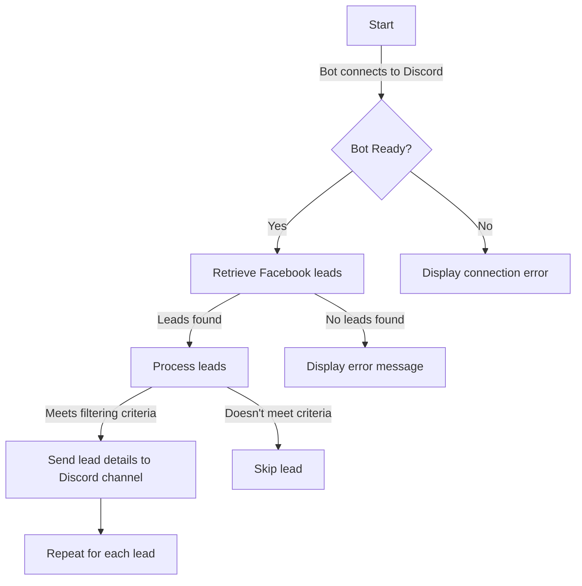

# Facebook Lead Automation Discord Bot

This Discord bot automates the retrieval of leads from a specified Facebook page and forwards the leads that meet certain criteria to a Discord channel.

## Flowchart

## Steps
1. **Bot Initialization:** The bot connects to Discord.
2. **Retrieve Facebook Leads:** The bot fetches leads from the specified Facebook page.
3. **Process Leads:** The bot checks if leads meet the filtering criteria.
4. **Send Lead Details to Discord:** If the lead meets the criteria, its details are sent to a Discord channel.
5. **Repeat:** Steps 3 and 4 are repeated for each lead.
6. **Error Handling:** If there's an issue with the connection or retrieval, error messages are displayed.

## Requirements
- Discord.py
- Requests
